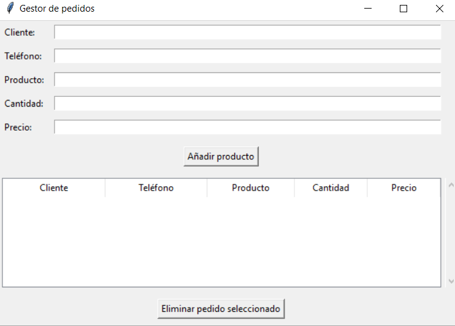
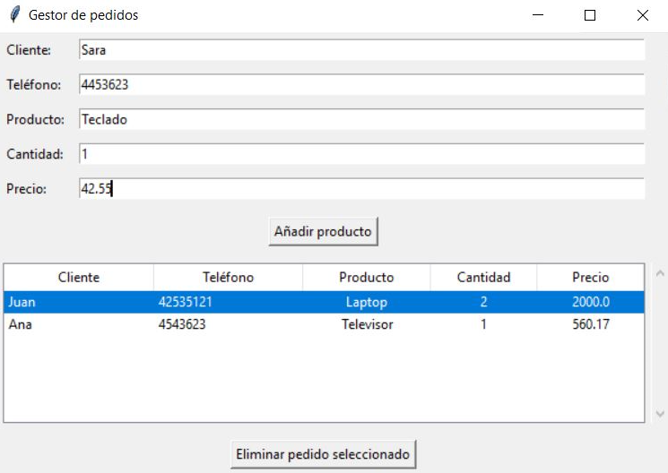

## Gestor de Pedidos

Aplicación de escritorio creada con **Tkinter** para registrar, visualizar y gestionar pedidos de clientes.

## Características

- Añadir pedidos con:
  - Nombre del cliente
  - Teléfono
  - Producto
  - Cantidad
  - Precio
- Ver los pedidos guardados en una tabla interactiva
- Eliminar pedidos seleccionados
- Guardado automático en `pedidos.json`
- Carga automática al iniciar

## Capturas de la interfaz




## Cómo usar

1. Ejecuta el archivo con Python 3:
```bash
python gestor_pedidos.py
```
2. Añade los datos del pedido.
3. Puedes eliminar los pedidos de la tabla.
4. Los pedidos se guardan automáticamente en el archivo `pedidos.json`.

## Licencia
Este proyecto está bajo la licencia MIT. Consulta el archivo [LICENSE](LICENSE) para más detalles.

## Autor
Josu Ramos